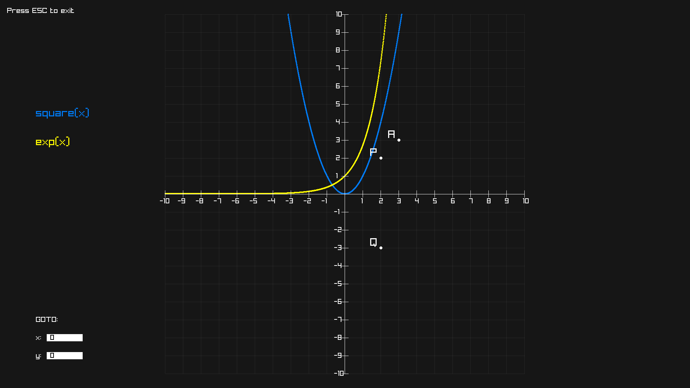
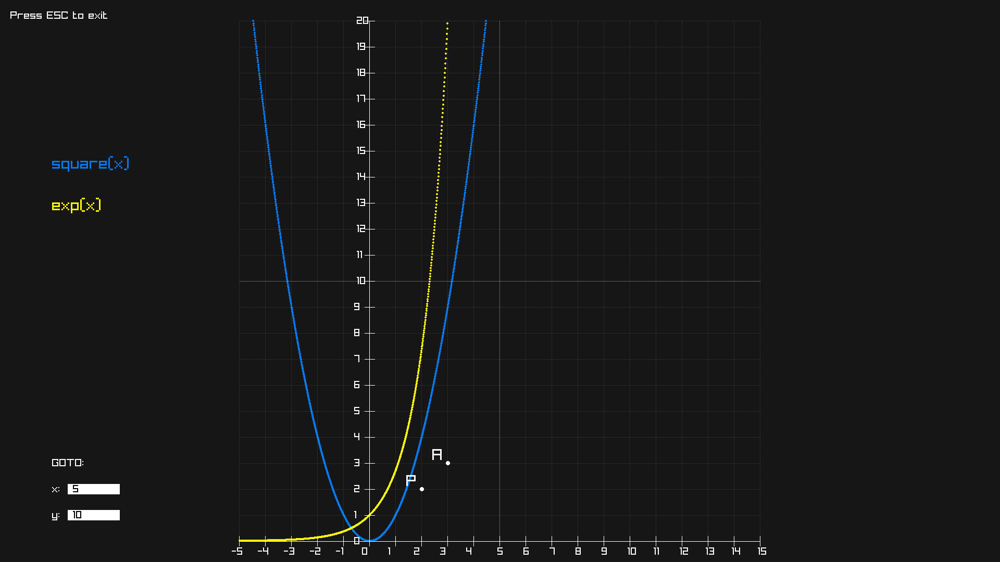

# XY PLOT ENGINE

## Installation

```bash
git clone https://github.com/Bilodev/XYPlotEngine
cd XYPlotEngine
make && ./main.exe
```

## Use

```c
#include "Engine/Engine.h"
```

Define your functions and costants $\newline$
Note that the "**NAN**" is used as **domain defintion**, in this case the function "costant" is only defined for $x <20 \lor x > 30$

```c
#define M_PI 3.14159265358979323846

double f(double x) { return x \* x; }
double constant(double x)
{
if (20 < x && x < 30) return NAN;
return 1;
}
```

Feed your functions to the engine

```c
int main()
{
    int error;

    engine_setname("My Loved Functions");

    error = engine_feed_function("square", f);
    if (error) {
        printf("%s", engine_get_error());
        return 1;
    }
    engine_feed_point("P", 2, 2);
    engine_feed_point("A", 3, 3);
    engine_feed_point("Q", 2, -3);

    engine_feed_function("exp", exp);

    engine_draw();
    return 0;
}
```

## Result



## More

- The user can toggle the visibility of the functions by clicking on their name.
- The user can specify x and y coordinates to see the function in specific points.
- The user can move the graph using the arrow keys.
- The maximum functions and points the user can feed is set to 5 each.


